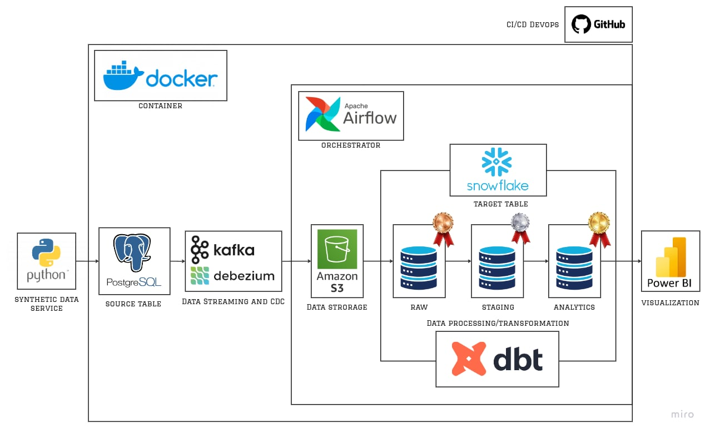

# Realtime Banking Data Pipeline

## Project Overview
This project implements a **realtime banking data pipeline** that simulates banking operations and processes them through a modern data stack. The pipeline captures transactions, customers, accounts, and ledger entries, applies transformations and validations, and visualizes KPIs using Power BI.  

Key features include:
- Realtime ingestion using **Debezium + Kafka**
- Storage in **PostgreSQL** and **Snowflake**
- Data transformation and SCD2 implementation with **dbt**
- Containerized architecture using **Docker** and **Docker Compose**
- CI/CD pipeline for automated deployment
- Automated email notifications for DAG runs

---

## Architecture

### Data Flow

1. **Fake Data Generation**
   - Python script generates synthetic banking data.
   - Tables: `transactions`, `customers`, `accounts`, `ledger_entries`.
   - Data stored in **PostgreSQL**.

2. **Debezium + Kafka**
   - Debezium monitors PostgreSQL WAL for changes.
   - Changes are pushed to **Kafka** topics.

3. **MinIO/S3 Storage**
   - Kafka messages are stored as files in **MinIO/S3**.

4. **ETL DAG: `MinIO_S3_to_Snowflake`**
   - Downloads newly pushed files from MinIO/S3.
   - Loads files into **Snowflake raw schema**.
   - Sends email notification summarizing number of files loaded per table.
   - Triggers the next DAG (`DBT_Bank_Data_Transformation_Pipeline`).

5. **Transformation DAG: `DBT_Bank_Data_Transformation_Pipeline`**
   - **Flatten tables** and store in **staging schema**
     - Run **dbt tests** on staging tables.
   - Run **dbt snapshots** for SCD2 changes on `accounts` and `customers`.
   - Transform final analytics tables:
     - `transactions` is incremental
     - `customers` and `accounts` incorporate SCD2 changes
     - Run **dbt tests** on the final layer.
   - Sends email notification when the DAG completes successfully.

6. **Visualization**
    
   - Power BI dashboards display KPIs such as:
     - Total Balance
     - Total Transactions
     - Average Balance per Account
     - Total Accounts
     - Total Customers
     - Total Transaction Amount Over Time
     - Average Balance per Account Type
     - Total Transaction Amount per Transaction Type
     - Average Balance by Account Type
     - Total Customers Balance

---

## Folder Structure

---

## Docker & Deployment
- All components (PostgreSQL, Kafka, MinIO, dbt, Snowflake connectors) are containerized with **Docker**.
- **Docker Compose** is used to manage the multi-container environment.
- Python fake data generator and Power BI are not containerized.

---

## CI/CD
- Implemented simple CI/CD pipelines via **GitHub Actions**:
  - Automated build and test
  - Deploy DAGs and dbt models

---

## Power BI KPIs
- Total Balance
- Total Transactions
- Average Balance per Account
- Total Accounts
- Total Customers
- Total Transaction Amount Over Time
- Average Balance per Account Type
- Total Transaction Amount per Transaction Type
- Average Balance by Account Type
- Total Customers Balance

---

## Notes
- PostgreSQL tables: `transactions`, `customers`, `accounts`, `ledger_entries`.
- Snowflake schemas: `raw`, `staging`, `analytics`.
- DAG email notifications include file counts and run status.
- dbt snapshots implement **SCD2** for customer and account history.
